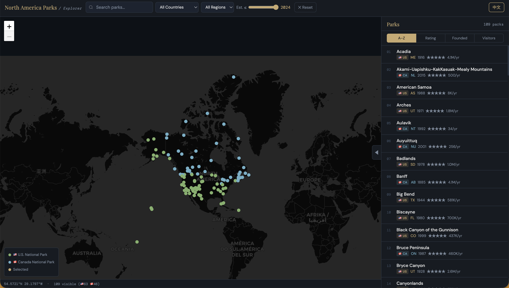

# 🏔️ North America National Parks Explorer

> *Because staring at a spreadsheet of 109 parks is nobody's idea of a good time.*

**[📖 中文版 README →](README_zh.md)**

---


*The full dashboard — dark map, bilingual sidebar, and a detail panel that actually tells you something useful.*

---

## What Is This?

An interactive map dashboard covering every officially designated national park in the **United States (63)** and **Canada (46)** — 109 parks in total, hand-curated with bilingual descriptions, real visitor stats, and live Wikipedia photos.

Built as a single self-contained HTML file. No npm install. No build step. No backend. Open it in a browser and it just works.

---

## Features

**🗺️ The Map**
- Dark-themed Leaflet map centered on North America
- 🟢 Green markers = U.S. parks · 🔵 Blue markers = Canadian parks
- Click any marker to fly to that park and open its detail panel
- Map bounds restricted to North America — no accidental scrolling to Antarctica
- Park names in popups link directly to their Wikipedia article

**🔍 Filtering**
- Search by name (works in both English and Chinese)
- Filter by country (🇺🇸 / 🇨🇦) and province/state
- Year slider from 1872 (Yellowstone) to 2024 (Pituamkek)
- 4-way sort: alphabetical, rating, founding year, or visitor count

**📋 Sidebar**
- Full ranked list of all visible parks
- Hover any park name to reveal a `↗` Wikipedia link
- Country badge, region, founding year, rating, and visitor stats at a glance
- French names shown in italics for Québec parks (Forillon, La Mauricie, Mingan Archipelago)

**📰 Detail Panel**
- Opens at the bottom when you select a park
- Wikipedia photo loaded automatically (REST API, 4-second timeout, background preloading)
- Stats: rating, annual visitors, area, established year, location
- Full bilingual description written from scratch — not a Wikipedia copy-paste

**🌐 Language Toggle**
- Switch between English and Chinese with one click
- Everything translates: UI labels, park names, descriptions, area units (acres ↔ 万公顷)
- Québec parks show their French name as a subtitle in English mode

---

## Parks Coverage

| Country | Count | Established Range | Most Visited |
|---|---|---|---|
| 🇺🇸 United States | 63 | 1872–2020 | Great Smoky Mountains (12.9M/yr) |
| 🇨🇦 Canada | 46 | 1885–2022 | Banff (4.1M/yr) |

Some highlights across the 109:

- **Most remote**: Tuktut Nogait, NWT — sometimes fewer than 5 visitors per year
- **Largest**: Wrangell–St. Elias, AK — bigger than Switzerland
- **Smallest**: Gateway Arch, MO — 91 acres of gleaming stainless steel
- **Oldest**: Yellowstone, 1872 — the world's first national park, full stop
- **Newest**: Pituamkek, PE (2022) — established in partnership with the Lennox Island Mi'kmaq community
- **Most dramatic geology**: Gros Morne, NL — you can literally walk on Earth's mantle

---

## Contributing

Spotted a wrong coordinate? A description that undersells a park? A visitor stat that's two years out of date? PRs are welcome.

The park data lives in the `PARKS` array near the top of the `<script>` block. Each entry looks like:

```js
{
  id: 1,
  country: "US",
  name: "Yellowstone",
  zh: "黄石国家公园",
  region: "WY/MT/ID",
  lat: 44.428, lng: -110.589,
  year: 1872,
  rating: 4.9,
  visitors: 4860000,
  areakm: 8983,
  desc: "English description...",
  descZh: "中文描述..."
}
```

French names for Québec parks use the optional `nameFr` field.

---

## License

MIT. Take it, fork it, embed it, print it on a tote bag.

---

*Made with an unreasonable amount of attention to park descriptions and an equally unreasonable fondness for dark map tiles.*
